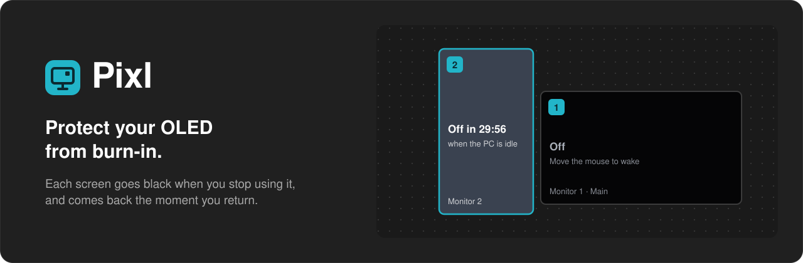
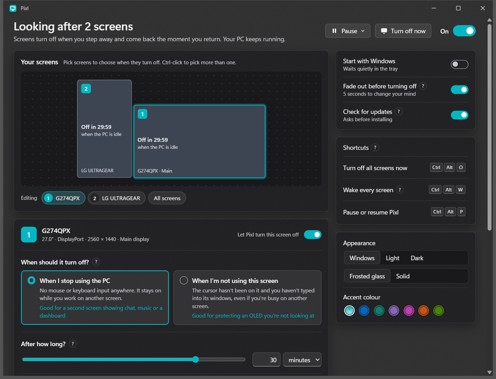

<p align="center">
  
</p>

<p align="center">
  <a href="https://github.com/BraxtonElmer/pixl/releases/latest"></a>
  
  <a href="LICENSE"></a>
  <a href="https://ko-fi.com/akariyu"></a>
</p>

<p align="center">
  <a href="https://github.com/BraxtonElmer/pixl/releases/latest"></a>
  &nbsp;
  <a href="https://ko-fi.com/akariyu"></a>
</p>

## Why I built this

I code a lot, and I usually have other work running alongside it. Some nights
I fall asleep with the PC still on, and my OLED sits there showing the same
editor for hours, which is exactly how burn-in happens. Windows can only turn
every screen off at once, and only after the whole PC has gone idle. So I
built Pixl: it turns each screen black on its own schedule while the PC and
everything on it keeps running, and brings it back the moment I sit down
again.

## What it does

- **A rule per screen.** Turn a screen off when the PC is idle, or when you
  haven't used *that* screen, even while you're busy on another one. Pick
  the time with a slider or type anything from 10 seconds to 24 hours.
- **Black, not powered off.** On OLED, black pixels are switched off, so a
  black screen protects the panel like turning it off, and it can't leave a
  monitor stuck dark or shuffle your windows. The cursor is hidden too.
- **Knows when you're watching.** A playing video (OTT services too, by
  their sound), a fullscreen game or an app on your keep-on list keeps its
  screen on, even without touching the mouse. Music alone doesn't.
- **Gentle.** Screens fade out over 5 seconds first; touch anything to
  cancel. Any mouse movement or key brings them back, or only moving the
  cursor onto that screen, if you prefer.
- **Light.** The part that runs in the tray is about half a megabyte, uses
  about 2 MB of memory and no measurable CPU: it sleeps until a screen could
  actually turn off. The settings window closes completely when you close it.

<p align="center">
  
</p>

Shortcuts work anywhere and can be changed in the settings:
**Ctrl+Alt+O** turns every screen off now, **Ctrl+Alt+W** wakes them all,
**Ctrl+Alt+P** pauses or resumes Pixl.

## Install

Download the installer from the
[latest release](https://github.com/BraxtonElmer/pixl/releases/latest) and
run it. No admin rights are needed. There's also a portable zip if you'd
rather not install anything. Pixl checks for new versions about once a day
and asks before installing them.

## Build

Needs Rust and Node.js.

```powershell
./scripts/build.ps1              # ready-to-run copy in dist/
./scripts/build.ps1 -Installer   # also builds the Windows installer
```

Then run `dist/Pixl.exe`, or the installer from `target/release/bundle/nsis/`.

| Folder | What's in it |
| --- | --- |
| `crates/core` | The idle rules: when each screen fades, turns off and wakes. No Windows code, fully unit tested. |
| `crates/platform` | Monitor detection, settings file, running apps, start with Windows. |
| `crates/tray` | `Pixl.exe`: tray icon, watching for input, the black screens. |
| `settings` | The settings window (Tauri + Svelte). |

## Support

Pixl is free and open source. If it saves your screen, you can buy me a
coffee:

<a href="https://ko-fi.com/akariyu"></a>

## License

Pixl is free software, licensed under the [GNU General Public License v3.0](LICENSE).
